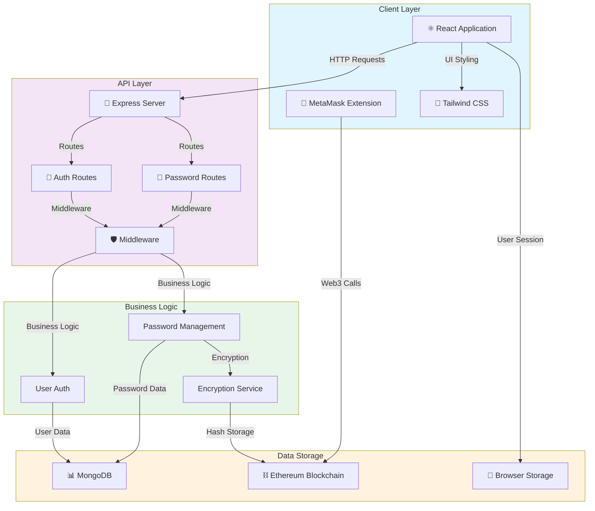
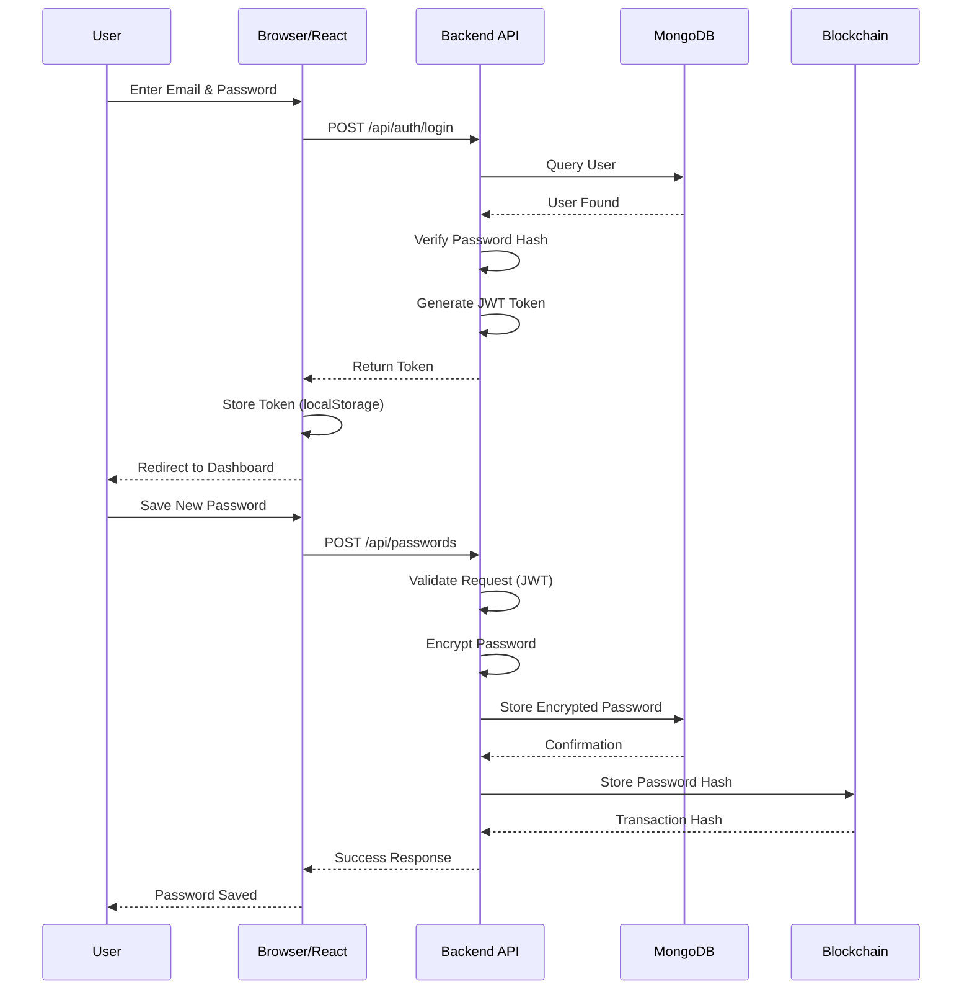
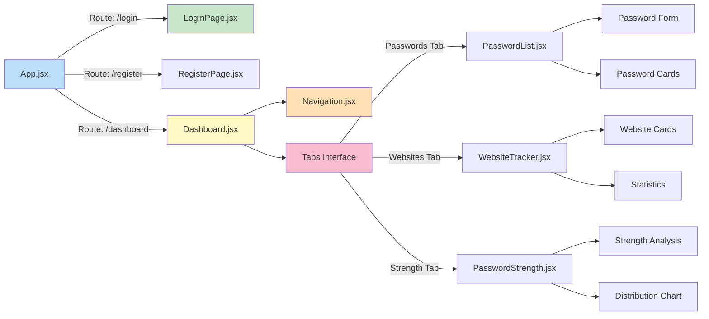
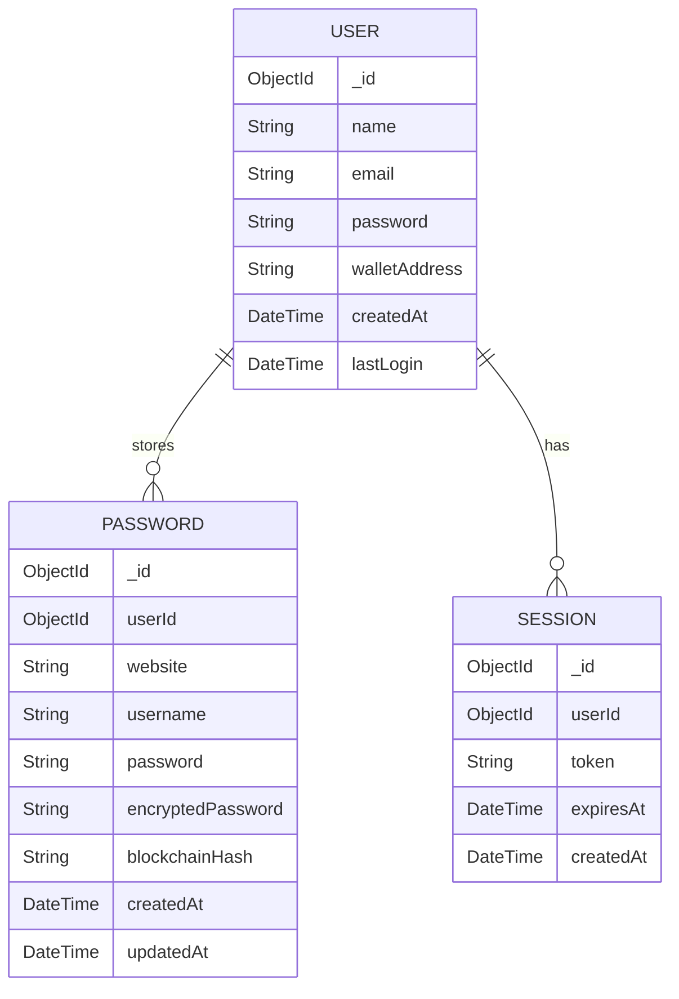
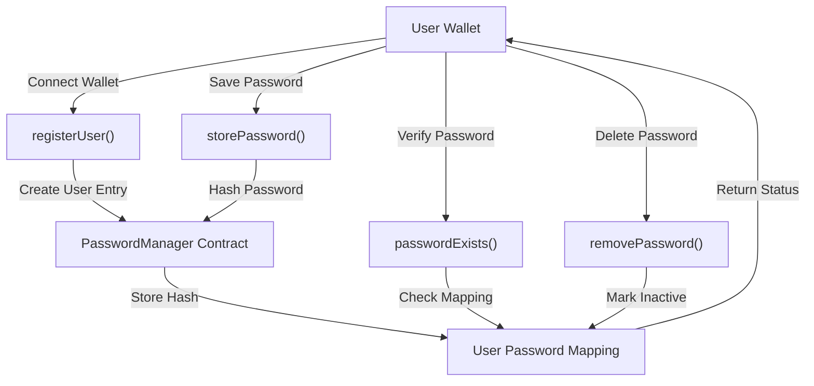
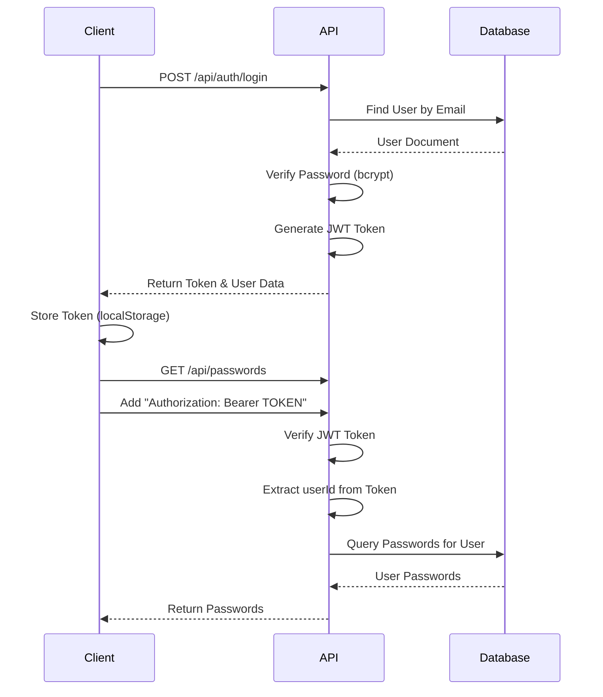
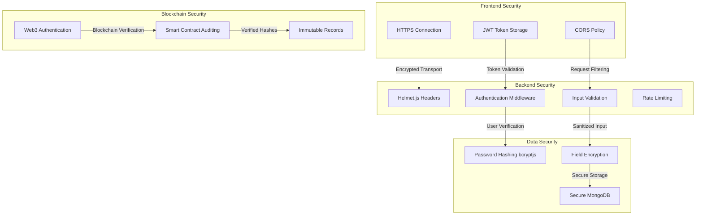
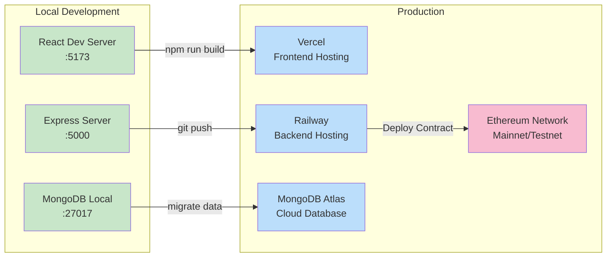
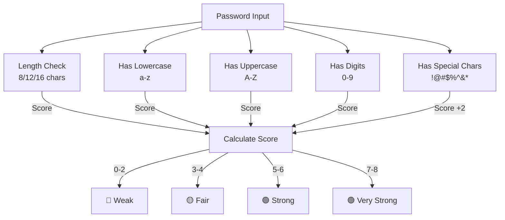
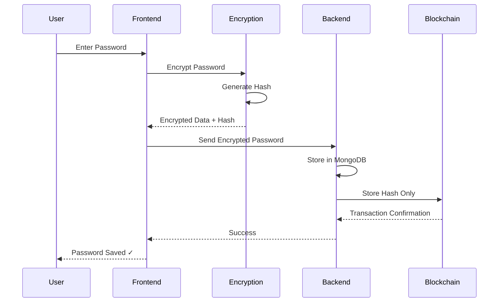

# Architecture & System Design

## System Architecture

## Data Flow Diagram

## Component Architecture

## Database Schema

## Smart Contract Flow

## API Authentication Flow

## Security Architecture

## Deployment Architecture

## Password Strength Algorithm

## File Upload & Encryption Flow

---

## Key Architectural Decisions

### 1. **Frontend Architecture**
- **React** for component-based UI
- **Vite** for fast development builds
- **Tailwind CSS** for utility-first styling
- **React Router** for SPA navigation

### 2. **Backend Architecture**
- **Express** for lightweight REST API
- **MongoDB** for flexible schema
- **JWT** for stateless authentication
- **Middleware** for cross-cutting concerns

### 3. **Security Architecture**
- **Encryption** on both client and server
- **Hashing** for password storage
- **HTTPS** for secure communication
- **Blockchain** for immutable records

### 4. **Scalability Considerations**
- Stateless API design
- Database indexing on userId
- Caching layer ready (Redis)
- Microservice-ready structure

---

For more details, see [README.md](README.md) and [SETUP_GUIDE.md](SETUP_GUIDE.md)
